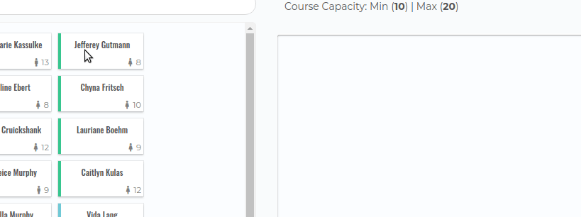
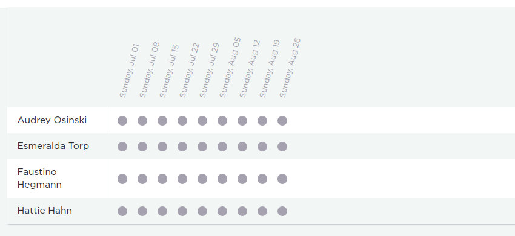
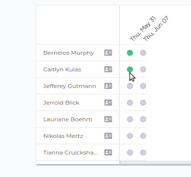

# Roll Call

Roll Call is a tool for non-profits and NGOs to plan, schedule and manage all aspects of their course curriculum. Program managers can schedule upcoming courses, manage volunteer and student communication, and drive business decisions through our advanced dashboard.

Volunteers are able to manage all aspects of their classroom like noting teacher attendance.

Roll Call was built over 9 days as the final project for Le Wagon Bootcamp.

It is currently being used by a non-profit in Singapore.

## Why We Built It

## Noteworthy Features

### Dashboard

We used the gem `chartkick` to integrate with `Chart.js` to display stastics our non-profit use everyday for business decisions.

`insert image`

**Attendance** - Program managers need to know the average benchmark attendance throughout the life of their program, so they can compare that to ongong courses. Managers use this information to determine when to interviene if there is an issue with an entire class (teacher) or on an individual student basis.

**Student Demographics** - Funding for the non-profit often comes from donors who want a certain demographic in the classes (a high female count for e.g.), so providing this information quickly allows program managers to focus recruitment on a specific demographic.

**Teacher Proficiency** - To scale any course subject the non-profit needs the necessary amount of teachers for those courses. Therefore, teacher proficiency information displays how many courses of a given subject can be run at any given time.

**Miscellaneous** - Program managers need to account for odd cases. For instance, if a course doesn't have a teacher assigned yet, or if a course that is going to run hasn't met the minimum number of students requirement, they need to be alerted.


### Drag and Drop Student Assignment

From a usability standpoint, the drag and drop feature compared to a multi-select list with a submit button was about the same. We just wanted to build something JavaScript intense and flashy.



We created `dragstart`, `dragover`, `dragenter`, and `drop` events to create a simple user experience. As soon as the students are dropped into our `drop-area`, an AJAX request automatically adds the student to the course. Since the `student-cards` contained student data we needed for the request, we had to pass that via the DataTransfer object `e.dataTransfer.setData("ids", ids);`.

This is where all the magic happened:

```
assignedStudents.addEventListener('drop', function(e) {
    const target = e.target;
    const data = e.dataTransfer.getData("ids").split(',');
    const studentCard = document.getElementById(data[0]);

    e.preventDefault();
    e.stopPropagation();

    assignedStudents.appendChild(studentCard);

    saveStudentRoster(data[0], data[1]);
  });
  ```

### Multi-Select Filtering

Over the span of a single year, our non-profit can run anywhere from 80-400 courses depending on volunters and funding. We needed a way to allow the program manager to quickly and efficiently be able to sort through all of that data.


`image goes here`


Therefore, we built scopes on our `courses` model:

```
# Course location filters
scope :locations, -> (locations) { where('addresses.venue_name': locations).joins(:address) }
# Course subject filters
scope :subjects, ->(subjects) { where('subjects.name': subjects).joins(:subject) }
# Course status filters
scope :status, -> (status) { where(status: status) }
```

and use them in a cascading style in the `controller:`

```
# Filter by location
@courses = @courses.locations(params[:address].keys) if params[:address].present?
# Filter by subject
@courses = @courses.subjects(params[:subjects].keys) if params[:subjects].present?
# Filter by status
@courses = @courses.status(params[:status].keys) if params[:status].present?
```
Each filter has an a click event that reloads the available courses via AJAX:

```
function filter() {
  let form = document.getElementById('filter');
  let inputs = document.querySelectorAll('.checkbox')
  let submit = document.getElementById('submit');

  inputs.forEach(function(input) {
    input.addEventListener("click", function() {

      submit.click();
    });
  });
}
```

### Attendance Management

We needed a way to easily allow teachers manage all of their classes. Our attendance page was designed to allow teachers to update attendance in one screen for every single session of the course.




Teachers never have to navigate from this screen. They are able to mark attendance for every student with the click of a button. Since the attendance circles for each session are not links, buttons or forms, we had to manually create the AJAX request in JS instead of using Rails' built in `query_ujs` library.



```
function updateAttendance(e) {
  const request = new XMLHttpRequest();
  const target = e.target
  const courseId = target.dataset.course
  const attendance = target.dataset.attendance

  // Call a function when the state changes
  request.onreadystatechange = function() {
    if(request.readyState == XMLHttpRequest.DONE && request.status == 200) {
      changeColor(e, JSON.parse(this.responseText));
    }
  }

  request.open("PATCH", `/courses/${courseId}/attendance`, true);
  // Send the proper header information along with the request
  request.setRequestHeader("Content-Type", "application/json");
  request.send(`{"attendance": "${attendance}"}`);
}

function initialize() {
  document.querySelectorAll('.attendance').forEach(function(e) {
    e.addEventListener('click', updateAttendance);
  });
}
```

## Usage
run bundle isnteall, yarn install
webpacker, jsdatepicker
chartjs
momentjs
